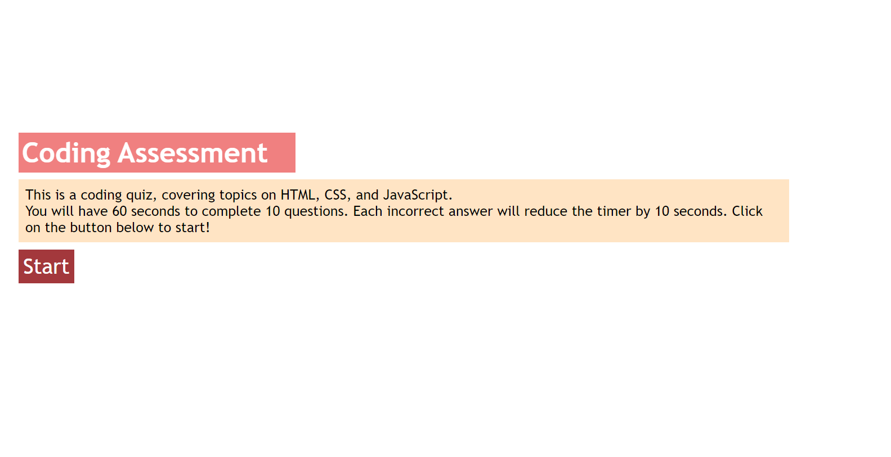

# coding-assessment

## Description
A coding quiz that was largely created using JavaScript. The quiz is timed with a time limit of 75 seconds and 10 questions, all relating to HTML, CSS, and/or JavaScript. Each incorrect answer subtracts 10 seconds from the timer. After completing the quiz, there is an option to record your score and initials, as well as the option to try the quiz again.

## Installation
N/A

## Deployed Page

## Usage
Access the deployed site at https://annie14254.github.io/coding-assessment/. Click on the "Start" button to start the quiz. Clicking on any of the answers to each question will advance to the next question.

## Credits
N/A
